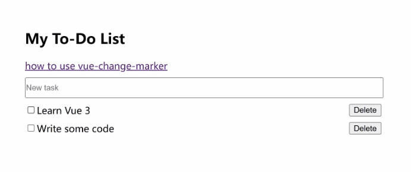

# vue-change-marker

When a vue component changes, vue-change-marker can highlight the changed component

[demo](https://linzhe141.github.io/vue-change-marker/)



> [!IMPORTANT]
> Only works in the dev environment

## Install

```bash
npm i vue-change-marker
```

```ts
import { VueChangeMarker } from 'vue-change-marker'
import { createApp } from 'vue'
import App from './App.vue'
// Before createApp
VueChangeMarker()

createApp(App).mount('#app')
```
